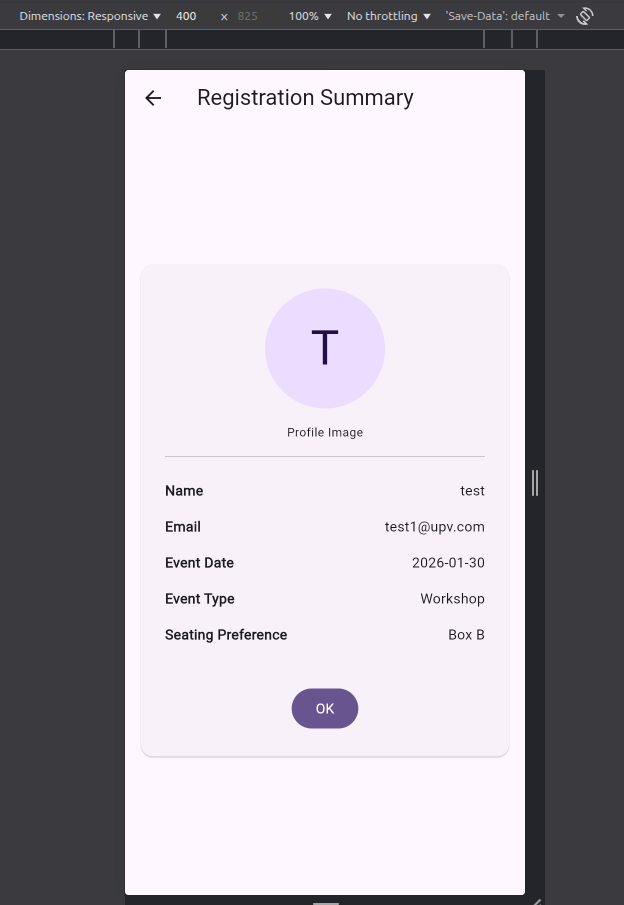

# Event Registration App - Practice 4

A full-featured Event Registration application built with **Flutter**. This project demonstrates advanced layout techniques, form validation, state management, and full Internationalization (i18n) support.

## 🚀 Features

- **Dynamic Registration Form**: Includes validation for name, email (regex), and mandatory selection fields.
- **Internationalization (i18n)**: Support for English, Spanish, and French with an custom language selection flow.
- **Modern UI/UX**: Built using Material 3 design principles with premium aesthetics.
- **Responsive Design**: Adaptation for different screen sizes and orientations.
- **Information flow**: Multi-step process with confirmation modals and a summary screen.
- **Profile Simulation**: Generates a user avatar based on registration data.

---

## 📸 Application Gallery & Walkthrough

Below are the key screens of the application with detailed descriptions of the implementation:

### 1. Main Registration Interface (English)

*Initial view of the app. It features a clean, card-based layout with custom icons for each input field. The globe icon in the top-right corner provides quick access to the language selector.*

### 2. Form in Spanish & Validation State

*Demonstration of the system's internationalization. All labels, hints, and error messages are fully translated. This view shows a filled form ready for submission.*

### 3. Custom Language Selector Dialog

*A custom-built modal dialog that allows the user to switch the app's locale globally. It uses a callback pattern to update the state of the entire application instantly.*

### 4. Confirmation Modal

*Before finalizing the registration, the app presents a confirmation dialog. This prevents accidental submissions and ensures the user is ready to proceed to the summary.*

### 5. Final Registration Summary

*The final screen displays a simulated profile avatar (using the user's initial) and a clear, well-structured list of all the submitted registration details.*

### 6. Responsive Design (Landscape)

*The application is fully responsive. Using `OrientationBuilder`, the layout adapts automatically to landscape mode, providing an optimized experience for desktop or rotated mobile devices.*

---

## 🛠️ Technical Details

- **Language Switching**: Implemented using a callback mechanism from the UI to the main App state, ensuring reactive locale updates.
- **Modeling**: Uses a `RegistrationData` class to handle form state and serialization.
- **Localization**: Managed via `.arb` files and `flutter_gen` for type-safe string access.

## 📦 How to Install

1. Clone the repository.
2. Run your dependencies setup:
   ```bash
   flutter pub get
   ```
3. Launch the app:
   ```bash
   flutter run
   ```
