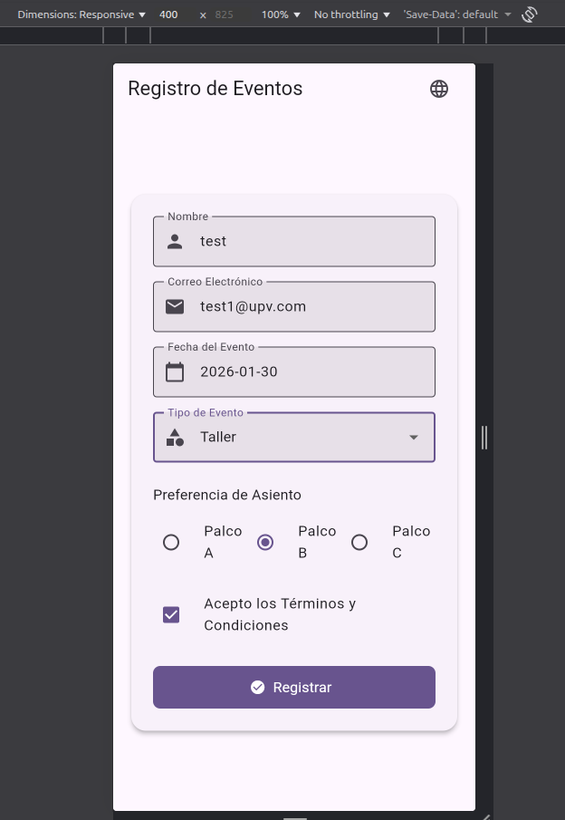
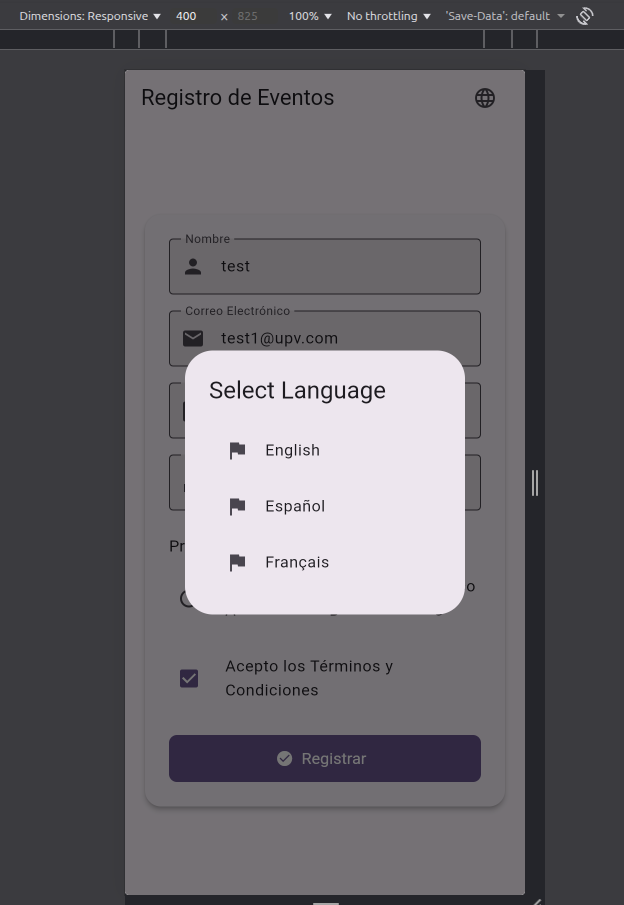
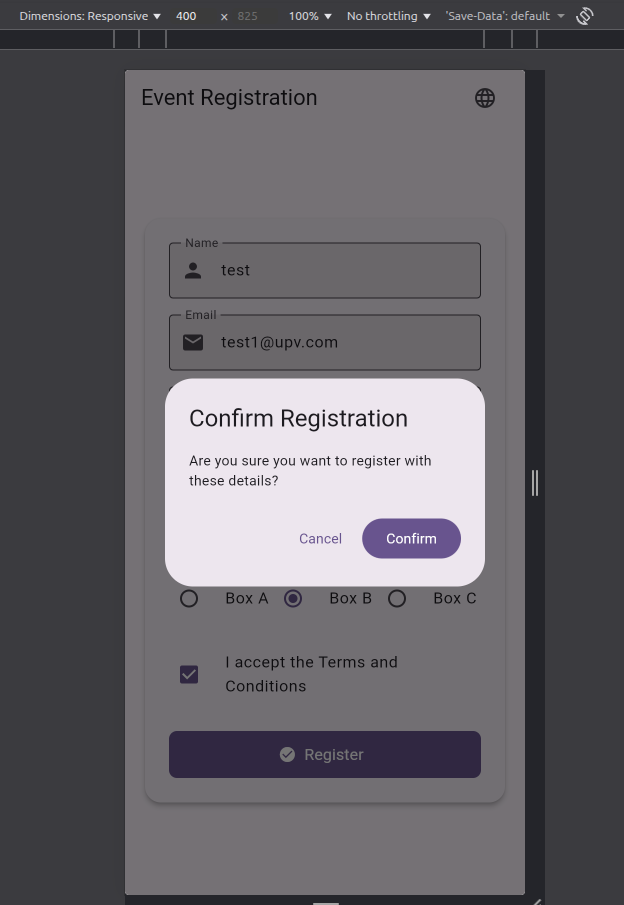
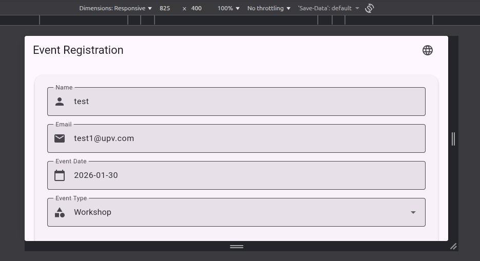

# Event Registration App - Practice 4

A full-featured Event Registration application built with **Flutter**. This project demonstrates advanced layout techniques, form validation, state management, and full Internationalization (i18n) support.

## 🚀 Features

- **Dynamic Registration Form**: Includes validation for name, email (regex), and mandatory selection fields.
- **Internationalization (i18n)**: Support for English, Spanish, and French with a custom language selection flow.
- **Modern UI/UX**: Built using Material 3 design principles with premium aesthetics.
- **Responsive Design**: Adaptation for different screen sizes and orientations.
- **Information Flow**: Multi-step process with confirmation modals and a summary screen.
- **Profile Simulation**: Generates a user avatar based on registration data.

---

## 📸 Application Gallery & Walkthrough

Below are the key screens of the application with detailed descriptions of the implementation:

### 1. Main Interface (First Screen)

*Esta es la interfaz de la primera pantalla del proceso de registro. Presenta un diseño limpio basado en tarjetas con campos para nombre, correo, fecha y tipo de evento.*

### 2. Language Selection Flow

*Panel utilizado para cambiar el idioma de la aplicación. Soporta múltiples locales y actualiza toda la interfaz de forma reactiva.*

### 3. Registration Confirmation

*Diálogo modal que aparece para confirmar la registración antes de proceder al resumen final, asegurando que los datos sean correctos.*

### 4. Summary Screen (Final Result)

*Segunda pantalla que se muestra después de registrar. Presenta un resumen de toda la información ingresada junto con una simulación de imagen de perfil.*

### 5. Adaptive Orientation

*Demostración de la orientación en anchura. La aplicación ajusta automáticamente sus márgenes y disposición de componentes cuando el dispositivo se pone en modo horizontal.*

### 6. Wide Responsive Layout

*Vista de la aplicación en una pantalla más larga/ancha, demostrando la capacidad del sistema para escalar y mantener una estética premium en diferentes resoluciones.*

---

## 🛠️ Technical Details

- **Language Switching**: Implemented using a callback mechanism from the UI to the main App state, ensuring reactive locale updates.
- **Modeling**: Uses a `RegistrationData` class to handle form state and serialization.
- **Localization**: Managed via `.arb` files and generated classes for type-safe string access.

## 📦 How to Install

1. Clone the repository.
2. Run your dependencies setup:
   ```bash
   flutter pub get
   ```
3. Launch the app:
   ```bash
   flutter run
   ```
